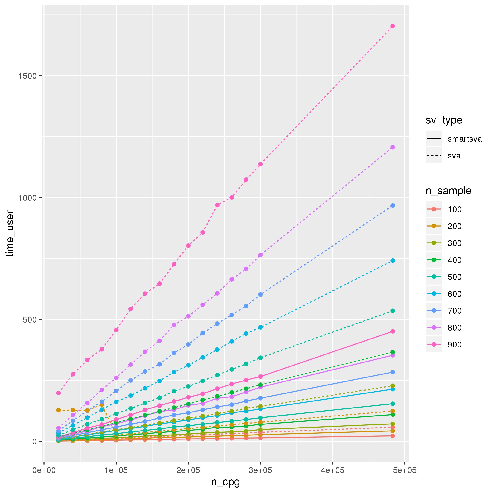
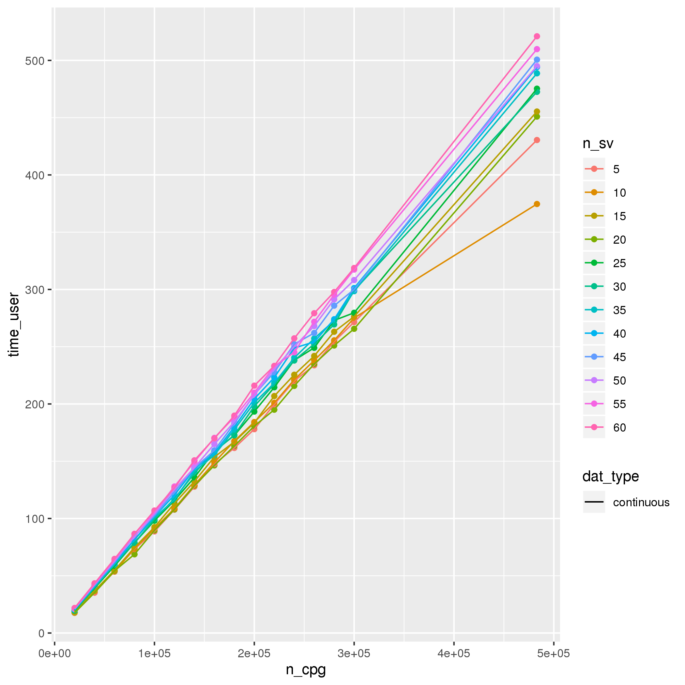
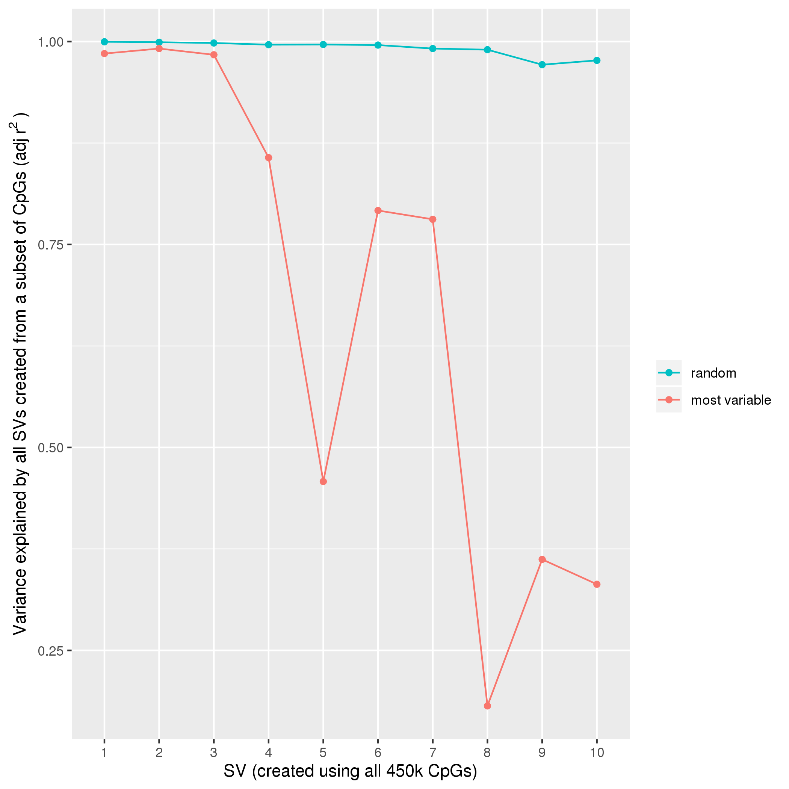
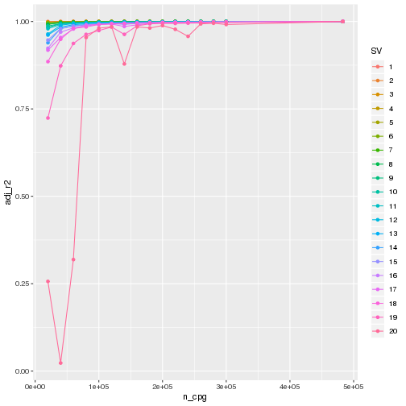

# Assessing the best practice for surrogate variable analysis in epigenome-wide association studies

## Aim:
To test the length of time taken to generate surrogate variables (SVs) using various different parameters and compare the SVs generated

## Methods:

### Data
Used the 450k data from ALSPAC mothers (timepoint = FOM, n = `r `). This is DNA methylation measured in whole blood samples. All CpGs were used for analysis. 

Phenotype data was simulated using the rnorm() function in R.

### Analysis
__Parameters tested:__
* SVA package - sva and smartsva
* Number of CpGs - increasing from 20,000 to 300,000 by increments of 20,000 + the full set of CpGs (`r`)
	+ And whether subsetting the CpGs to the most variable CpGs or a random set works best 
* Number of SVs - just comparison between using 10 and 20 SVs
* Number of samples - increasing from 100 to 900 by increments of 100

__SVA package:__
Time taken to run the analyses was compared as were the SVs generated by assessing the Pearsons correlation between SVs and how much of the variance of the SV generated by the sva package was explained by the same SV generated from the smartsva package.

We set the input parameters to be identical. These parameters were as follows:
* 
* 
* 

__Number of CpGs:__
Time taken to run the analyses and the SVs generated by subsets of CpGs were compared to the same factors when running the analyses using all CpGs on the 450k array. To compare the SVs we took each of the SVs generated using all CpGs on the 450k array and calculated the variance of each of these SVs explained by all the SVs generated using the subset of CpGs. i.e:

$$SVi ~ SV1' + SV2' + ... + SV20'$$

where _SVi_ is the ith SV generated using all CpGs from the 450k array. 

For the number of SVs and the number of samples we just assessed run time...
__Assess something else as well as run time for number of SVs???__ 

## Results

### Timings

### Smart vs normal sva

-------------------
 sv   cor   adj_r2 
---- ----- --------
 1     1      1    

 2     1      1    

 3     1      1    

 4     1      1    

 5    -1      1    

 6     1      1    

 7    -1      1    

 8     1      1    

 9     1      1    

 10    1      1    

 11   -1      1    

 12    1      1    

 13   -1      1    

 14    1      1    

 15   -1      1    

 16    1      1    

 17    1      1    

 18    1      1    

 19   -1      1    

 20   -1      1    
-------------------

### Effectiveness of subseting CpGs

