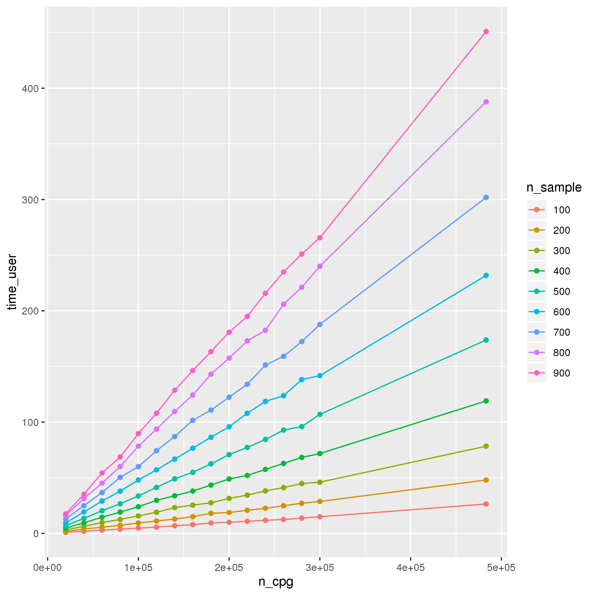
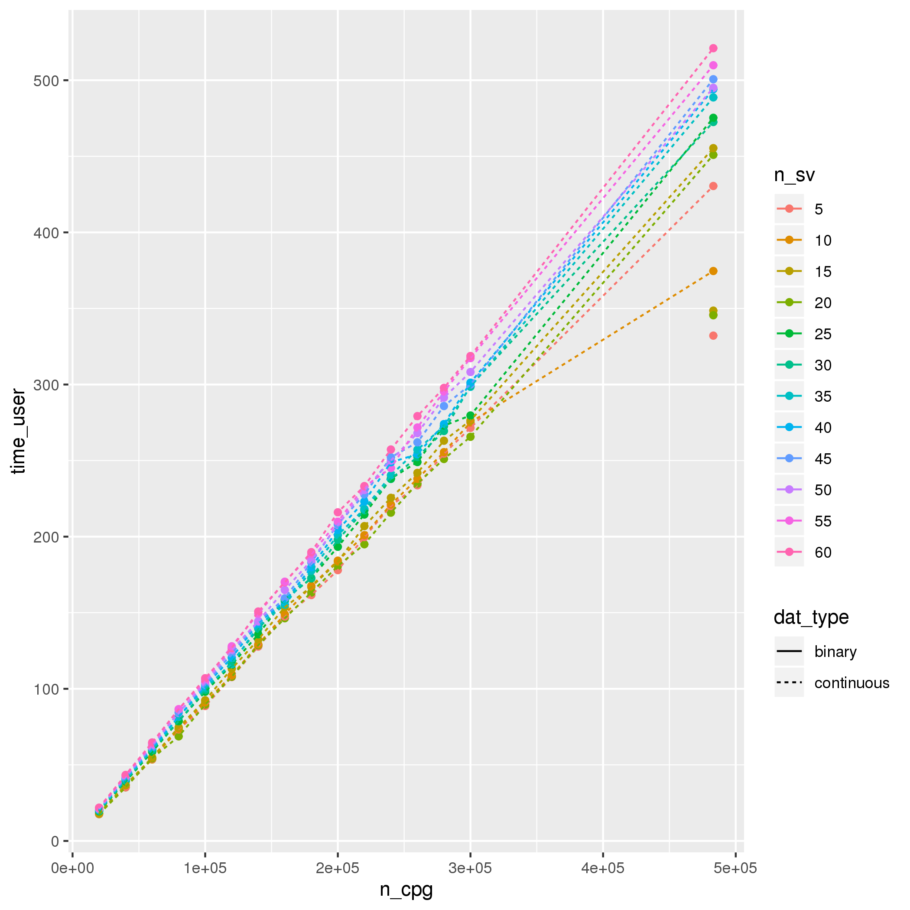
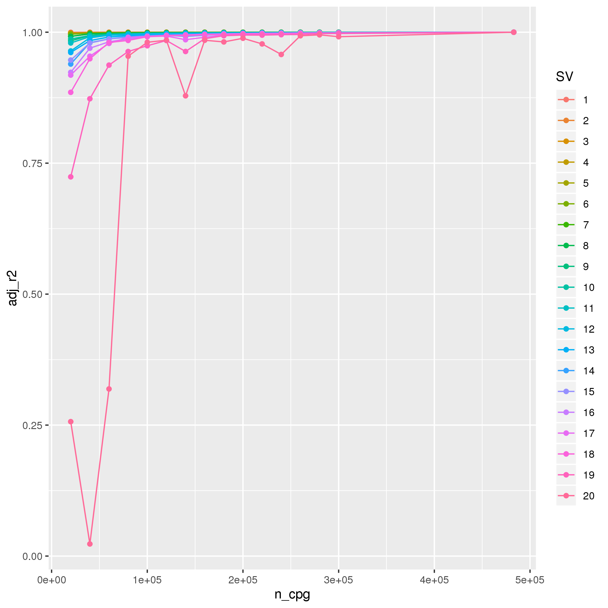

# Assessing the best practice for surrogate variable analysis in epigenome-wide association studies

## Aim:
To test the length of time taken to generate surrogate variables (SVs) using various different parameters, compare the SVs generated and find out how many SVs are needed to account for variation in typical covariates.

## Methods:

### Data
Used the 450k data from ALSPAC mothers (timepoint = FOM1, n = 900). This is DNA methylation measured in whole blood samples. All CpGs were used for analysis. 

Phenotype data was simulated using the rnorm() function in R or was clinic data taken from the FOM1 timepoint. Ten "independent" variables (-0.2 < r < 0.2) chosen. 

### Analysis
__Parameters tested:__

* SVA package - sva and smartsva
* Number of CpGs - increasing from 20,000 to 300,000 by increments of 20,000 + the full set of CpGs (4.83103 &times; 105)
	+ And whether subsetting the CpGs to the most variable CpGs or a random set works best 
* Number of SVs - comparison of 5, 10, 15, 20 SVs
* Number of samples - increasing from 100 to 900 by increments of 100

__SVA package:__

Time taken to run the analyses was compared as were the SVs generated by assessing the Pearsons correlation between SVs and how much of the variance of each SV generated using the sva package was explained by the same SV generated using the smartsva package.

We set the number of iterations used by each package to be the same and kept the other parameters as their defaults. 
 
Where unspecified, smartsva was chosen to run analyses.

__Effectiveness of subsetting CpGs:__
Time taken to run the analyses and the SVs generated by subsets of CpGs were compared to the same factors when running the analyses using all CpGs on the 450k array. To compare the SVs we took each of the SVs generated using all CpGs on the 450k array and calculated the variance of each of these SVs explained by all the SVs generated using the subset of CpGs. i.e:

$$SVi \sim SV1' + SV2' + ... + SV20'$$

where _SVi_ is the ith SV generated using all CpGs from the 450k array. 

For the number of SVs and the number of samples we just assessed run time.

__Number of SVs required__
The variance explained of often used covariates in EWAS by SVs was examined. The covariates chosen were: cell proportions derived using the Housemann method, two batch variables (BCD_id and MSA4Plate_id), age, and the top 10 genomic PCs. 

Normally distributed, random continous and binary variables were used as well as 10 randomly selected, independent (-0.2 < r < 0.2) variables from the FOM1 timepoint.

Firstly, the number of SVs required was estimated using either the num.sv() function from the sva package, with the "leek" method and by using random matrix theory as suggested by the smartsva package. The highest number of SVs estimated from either method was used as the maximum number of SVs required. 

Then, these SVs were generated for each trait using all of the probes on the 450k.

Finally, the cumulative variance explained by SVs for each covariate was examined. 

## Results

### Timings

### Smart vs normal sva

-------------------------------------
 SV   correlation   "adjusted r"^"2" 
---- ------------- ------------------
 1         1               1         

 2         1               1         

 3         1               1         

 4         1               1         

 5        -1               1         

 6         1               1         

 7        -1               1         

 8         1               1         

 9         1               1         

 10        1               1         

 11       -1               1         

 12        1               1         

 13       -1               1         

 14        1               1         

 15       -1               1         

 16        1               1         

 17        1               1         

 18        1               1         

 19       -1               1         

 20       -1               1         
-------------------------------------

correlation = Pearson's Rho,
adjusted r^2^ = The variance of the SV generated using the sva package explained by the the variance of the SV generated by the smartsva package.

### Effectiveness of subseting CpGs

Number of CpGs is set to 20,000

### Variance explained of covariates by SVs

Variance explained is cummulative, i.e. adjusted r2 at SV 10 on the plot is the variance explained by SVs 1-10.
rcont = normally distributed random continuous variable,
glc = glucose

---------------------------------------------------------
     cov        median_sv_95   median_sv_max     data    
-------------- -------------- --------------- -----------
     age             45             51         simulated 

    BCD_id           38             51         simulated 

    Bcell            37             51         simulated 

     CD4T            21             51         simulated 

     CD8T            15             51         simulated 

     Gran            6              51         simulated 

     Mono            38             51         simulated 

 MSA4Plate_id        40             51         simulated 

      NK             34             51         simulated 

     PC1             23             51         simulated 

     PC10            4              51         simulated 

     PC2             8              51         simulated 

     PC3             49             51         simulated 

     PC4             27             51         simulated 

     PC5             1              51         simulated 

     PC6             40             51         simulated 

     PC7             48             51         simulated 

     PC8             21             51         simulated 

     PC9             30             51         simulated 

     age            41.5            45           real    

    BCD_id          35.5            45           real    

    Bcell           15.5            45           real    

     CD4T            18             45           real    

     CD8T            16             45           real    

     Gran            9              45           real    

     Mono            41             45           real    

 MSA4Plate_id        36             45           real    

      NK             13             45           real    

     PC1             29             45           real    

     PC10            13             45           real    

     PC2            24.5            45           real    

     PC3             8              45           real    

     PC4             7              45           real    

     PC5             1              45           real    

     PC6             9              45           real    

     PC7             44             45           real    

     PC8             12             45           real    

     PC9             41             45           real    
---------------------------------------------------------

median_sv_95 = median number of SVs required to account for 95% of the variance of the total variance explained by all the SVs estimated,
median_sv_max = median number of SVs estimated to be required across traits,
these medians are split by whether the data is simulated or real. 

### Summary of findings
* smartsva was on average 4.2 times faster than sva
* There was no difference between the SVs generated using the different packages
* As number of samples increased and number of CpGs increased so did time taken to run SVA
* Little difference in time taken when using 5, 10, 15, or 20 SVs 
* SVA for binary variables was faster than continuous
* The variance explained by all SVs created using a subset of 20000 CpGs of each of the SVs created using all 4.83103 &times; 105 CpGs was greater when using a random subset compared to the most variable 20000 CpGs
	+ Variance explained decreases as the generated SV number increases (More variance explained for SV1 compared to SV10)
* Using all 20 SVs generated using a random subset of 20000 CpGs we explained over 90% of variance for the first 17 SVs generated using all 4.83103 &times; 105 CpGs and over 99% of variance for the first 8 SVs
* The num.sv() function with the "leek" method estimates far fewer SVs required than is estimated using random matrix theory
* Many SVs may be needed to explain a large proportion of some key covariates such as cell type and batch variables
* SVs explain very little of the variance of genomic PCs (in this sample)

